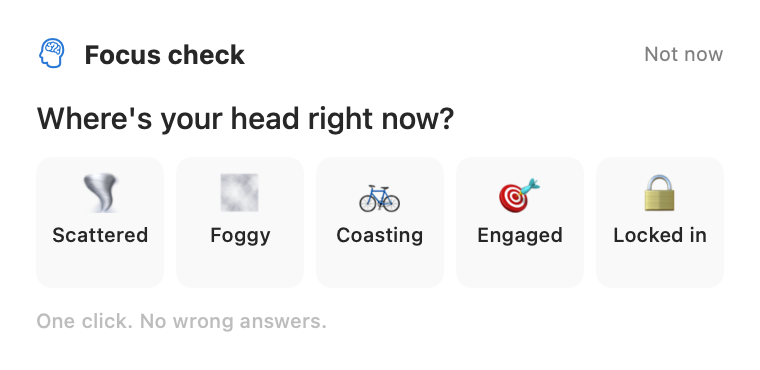
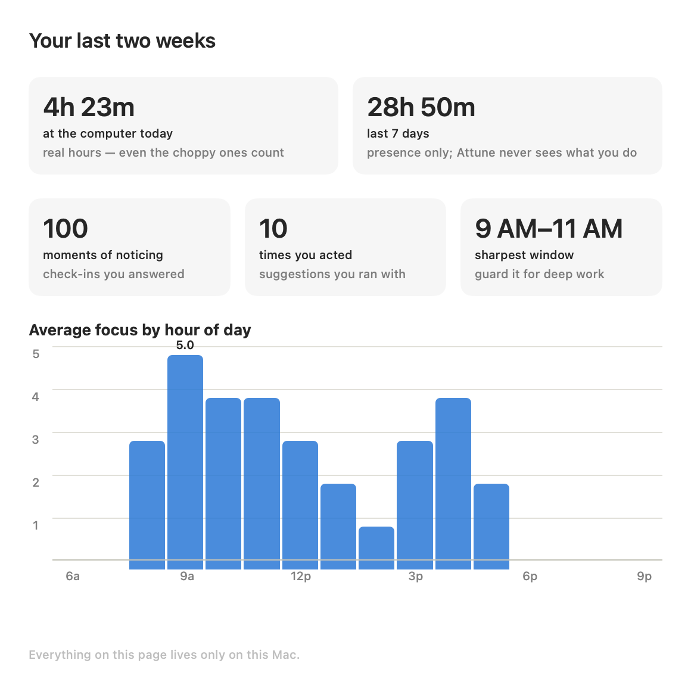

# Attune

**A gentle focus companion for ADHD brains that work at a computer all day.**

Attune lives in your macOS menu bar and checks in with you a few times a day
— ten seconds, two questions, one click each:

<p align="center">
  
</p>

Based on what you answer, it offers one piece of guidance grounded in
published attention research: keep going and it will get out of your way,
take a specific kind of break, park the worry that's circling, or — the
part most productivity tools won't say out loud — **spend this hour on the
laundry, on purpose, with a timer and a plan to come back.**

Work gets done when you're focused. When you're not, an hour at the desk
mostly produces frustration. Attune's job is to help you notice which hour
you're in, and feel good about what you do with it.

## Why this exists

If you have ADHD and a flexible schedule, you know this day: focus never
lands, everything gets interrupted, and by evening it *feels* like you did
nothing — so you keep working, later than you should, out of a debt that
may not even be real. ADHD reliably distorts the perception of time and the
memory of effort; anxiety fills the gap.

Attune pushes back with three mechanisms, each with research behind it
(full annotated bibliography in [docs/RESEARCH.md](docs/RESEARCH.md), design
rationale in [docs/DESIGN.md](docs/DESIGN.md)):

1. **Check-ins train noticing.** Self-monitoring is one of the
   best-evidenced behavioral interventions in ADHD — the recurring outside
   prompt substitutes for the internal monitoring that ADHD taxes, including
   body signals (hunger, fatigue) that ADHD brains measurably under-detect.
2. **Guidance matches the state you're actually in.** Restless gets
   movement (a single short bout of exercise measurably sharpens ADHD
   attention). Depleted gets a real break, outside if possible. Worry gets a
   parking lot. Boredom gets a 15-minute race. High focus gets *protected* —
   the app lengthens its own interval and leaves you alone. Sustained
   hyperfocus gets water, food, and a stretch, because your body's own
   reminders aren't firing.
3. **Real hours, measured locally.** Attune counts your actual at-keyboard
   time (presence only — never what you're doing) so the "did I work
   enough?" question gets answered with evidence instead of dread. Past a
   full day's hours with focus fading, Attune's advice changes to: *the
   hours are already in the bank — land the plane.*

<p align="center">
  
</p>

## Features

- **Menu bar native** — no Dock icon, no window clutter. A brain in the
  menu bar; a countdown next to it when a break timer is running.
- **Adaptive cadence** — checks in about every 45 minutes (configurable
  25–90). Reports of high focus stretch the interval; struggling tightens
  it. Never more than one check-in per 25 minutes.
- **One-click check-ins** — where's your head (5 states) → how's your body
  (3 states) → optionally, what's pulling at you. The panel floats
  top-right, never steals keyboard focus, and dismisses itself if ignored —
  a missed check-in is data, not a debt, and it never re-alerts.
- **Meeting-aware** — while you're on a Zoom call (Zoom running +
  microphone live, detected entirely on-device), check-ins hold, then
  arrive a couple of minutes after the call ends — research says the end of
  a task is the cheapest moment to be interrupted. An optional broader mode
  treats any microphone use as a call (covers Meet/Teams/FaceTime).
- **Break timers with a way back** — accepting a suggestion starts a
  countdown in the menu bar. Timed suggestions include an optional
  one-line "note to your future self" ("next: re-run the failing test");
  when the timer ends, the welcome-back prompt shows your note — the
  "ready-to-resume" plan that research says cuts attention residue, held
  by the app instead of your working memory.
- **Timers that follow you away from the Mac** — optionally, a break timer
  can ring your iPhone and Apple Watch through your own iCloud Reminders
  (no app servers — a Reminder due at timer end does the work), and/or POST
  a "head back" message to a webhook URL you choose: the free
  [ntfy](https://ntfy.sh) app covers Android, and Home Assistant users can
  flash the kitchen lights. Both off by default.
- **Insights** — your average focus by hour of day, learned from your own
  check-ins (ADHD chronotypes run later and vary more than office hours
  assume), your real at-computer hours today and this week, and counts of
  what you noticed and acted on. No streaks. No scores.
- **Work-day span** — alongside active hours, Attune tracks the *span* of
  your day: first activity to last, with unprompted breaks and time away
  folded in. Six focused hours inside a ten-hour bracket is a signal worth
  seeing — that's an early check-in and a late one, work bleeding into life.
  When the span runs long and focus is fading, the guidance shifts from
  "did you do enough?" to "the win now is separating." Shown in Insights and
  the menu; on-call days are legitimate, so it's information, never a scold.
- **Every suggestion shows its work** — a "why this works" disclosure with
  the research behind it.

## Privacy

**Everything stays on your Mac.** No accounts, no sync, no analytics, no
telemetry — nothing phones home. Your check-in history and activity record
are plain JSON files in `~/Library/Application Support/Attune/` that you
can read, export, or delete anytime.

The one nuance, stated plainly: the optional break-end webhook is a single
outbound POST to a URL *you* configure (off by default, off when empty),
and the optional iPhone/Watch ring works by creating a Reminder in your own
iCloud account — the app never talks to any server of its own, and only
ever touches reminders it created.

Activity tracking is **presence only**: it reads the system idle-time
counter (seconds since your last keystroke or mouse movement). It never
records what you type, which apps you use, or window contents. Meeting
detection checks only "is Zoom running" and "is the microphone in use" —
locally, with public APIs, no special permissions.

## Install

Requires macOS 14+.

```bash
git clone https://github.com/piekstra/attune.git
cd attune
Scripts/make-app.sh --install   # builds dist/Attune.app and copies to /Applications
```

Then launch Attune from Applications. It appears in the menu bar (brain
icon) and introduces itself with a first check-in. Enable "Launch at login"
in Settings if you want it always there.

To try it without installing:

```bash
swift run attune --check-in     # runs from the repo, shows a check-in immediately
```

### Flags

| Flag | What it does |
|------|--------------|
| `--check-in` | Show a check-in immediately on launch |
| `--diagnostics` | Print environment self-test (storage path, meeting detection state, computed intervals) and exit |
| `--help` | Usage |

## Known limitations

- **Meeting detection** errs toward silence: Zoom open in the background
  while another app uses the mic reads as "in a meeting" and defers the
  check-in. The failure mode is a late check-in, never an interrupted call.
- **Menu bar space**: on notched MacBooks with many status items, macOS can
  hide new items. If you don't see the brain icon, clear some menu bar
  space. Attune logs its status item visibility at launch
  (`log stream --process Attune`).
- The activity counter treats *any* input as activity — it can't tell work
  from browsing. It's a presence record, not a productivity judge (by
  design; see [docs/DESIGN.md](docs/DESIGN.md)).

## Development

```bash
swift build                 # build (works with Command Line Tools alone)
swift test                  # requires full Xcode (XCTest); CI runs this
Scripts/make-app.sh         # build dist/Attune.app
```

If `xcode-select -p` says `/Library/Developer/CommandLineTools` but you have
Xcode installed, point individual commands at Xcode's toolchain instead of
switching globally:

```bash
DEVELOPER_DIR=/Applications/Xcode.app swift test
```

(First time only, accept Xcode's license:
`sudo env DEVELOPER_DIR=/Applications/Xcode.app xcodebuild -license accept`.)

Architecture: `AttuneCore` (library — models, scheduling policy,
recommendation engine, storage, meeting detection, UI) + a thin `attune`
executable. The scheduling rules and recommendation matrix are pure
functions with exhaustive tests; the catalog of guidance copy is
hand-written, research-keyed, and unit-tested against a banned-vocabulary
list so nothing shaming ships.

## Disclaimer

Attune is a wellness tool built on published attention research. It is not
a medical device, does not diagnose or treat ADHD, and is no substitute for
care from an ADHD-informed clinician.

## License

[MIT](LICENSE)
